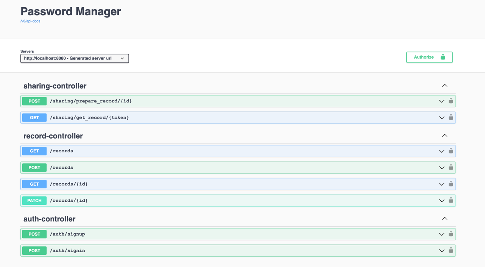
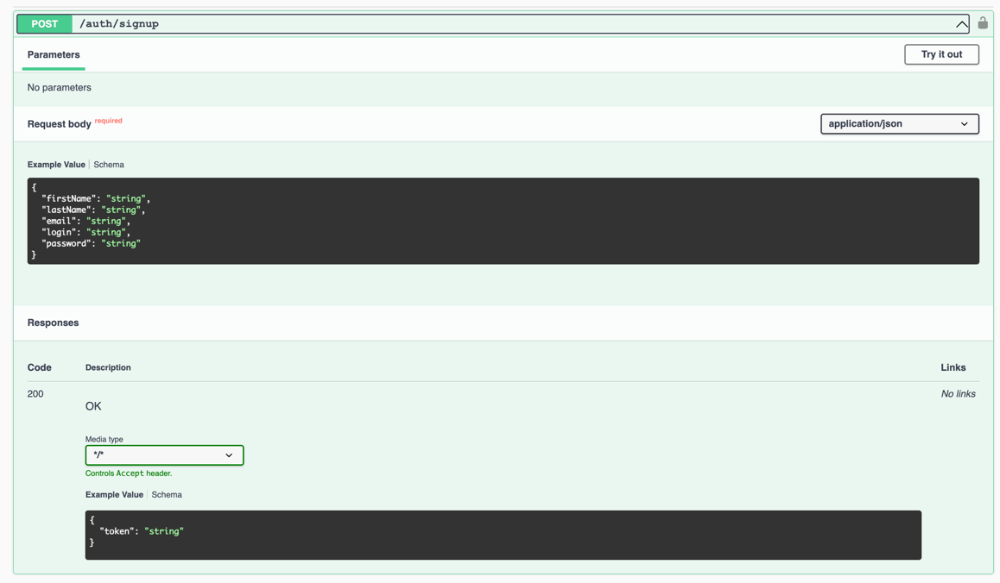
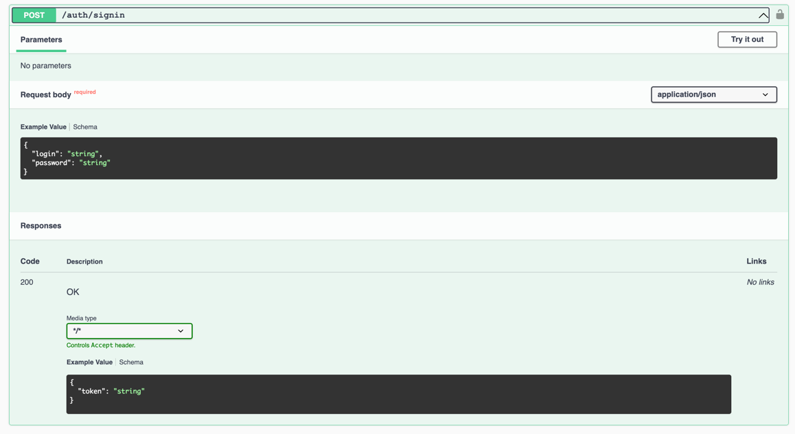
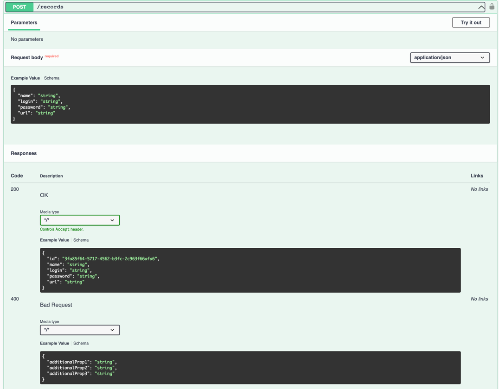
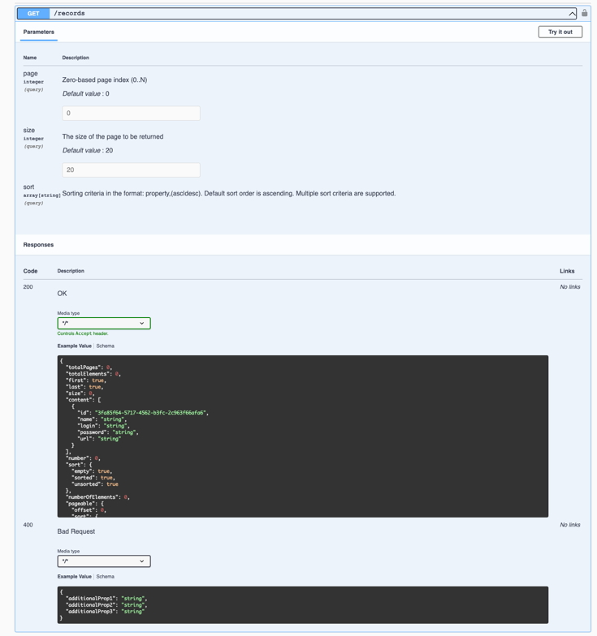

# Password Manager

## Description
Password Manager - password storage REST service

## Features
- all requests are secured except auth-controller requests. That's why, firstly, you need click button 'Authorize' and enter a jwt token received from one of the auth-controller requests

## What you can do in it
+ Create a new account
  
+ Sign in
  
+ Create a new password entity
  
+ Get short info (id and name of record) your own list of all entries with passwords
  
+ Get a specific record by its id

+ Update the record by id
+ Create a directory with records and other directories
+ Delete a directory
+ Make sharing on record
+ Get a sharing record from a person