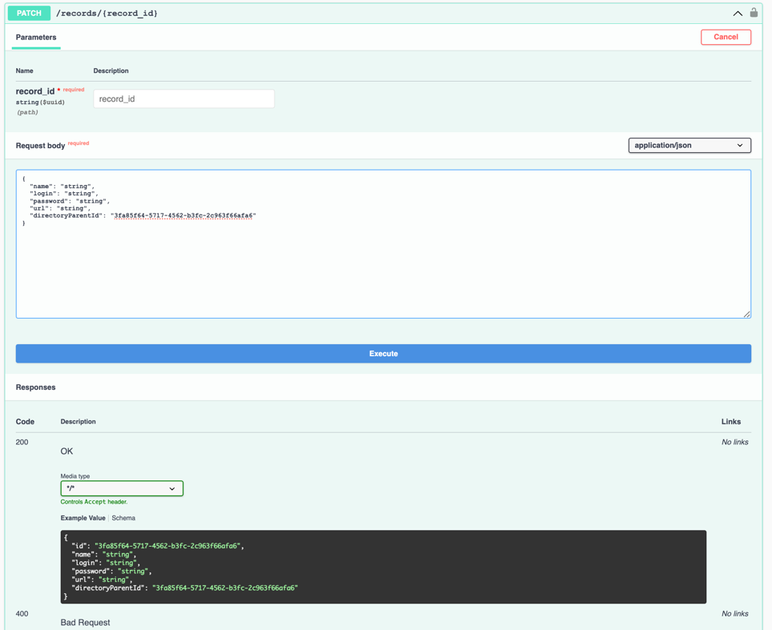

# Password Manager

## Description
Password Manager - password storage REST service

## Features
- all requests are secured except auth-controller requests. That's why, firstly, you need authorize and enter a jwt token received from one of the auth-controller requests

## What you can do in it
+ Create a new account
> 
+ Sign in
> 
+ Create a new password record
> 
+ Get your own list of records
> 
+ Get a specific record by its id
> 
+ Get info about password record directory
> 
+ Update a record by id - **переделать входные параметры (должен принимать не entity, а dto)**
> 
+ Create a directory for records and other directories
> 

> You can skip parametr 'parentDirectoryId' or set null if parent directory is root
+ Get short info about all records (id and name of record) in directory
> 
+ Get all nested directories in directory
> 
+ Get all attachments (nested records and directories) in directory
> 
+ Delete a directory
> 
+ Make sharing on record
> 
+ Get a sharing record from a person
> 
