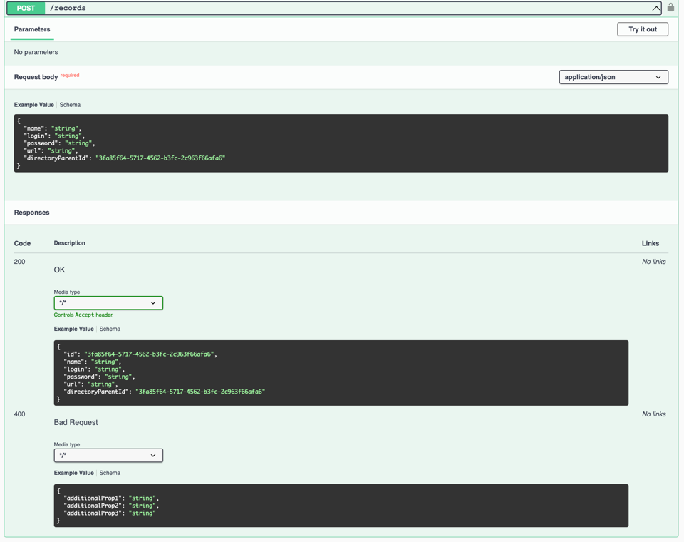
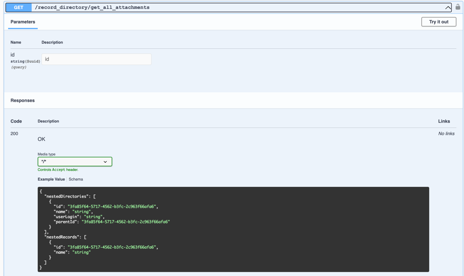

# Password Manager

## Description
Password Manager - password storage REST service

## Features
- all requests are secured except auth-controller requests. That's why, firstly, you need authorize and enter a jwt token received from one of the auth-controller requests

## What you can do in it
+ Create a new account
  
+ Sign in
  
+ Create a new password record
  
+ Get your own list of records

+ Get a specific record by its id

+ Get info about password record directory

+ Update a record by id - **переделать входные параметры (должен принимать не entity, а dto)**
+ Create a directory for records and other directories

you can skip parametr 'parentDirectoryId' or set null if parent directory is root
+ Get short info about all records (id and name of record) in directory

+ Get all nested directories in directory

+ Get all attachments (nested records and directories) in directory

+ Delete a directory

+ Make sharing on record

+ Get a sharing record from a person
